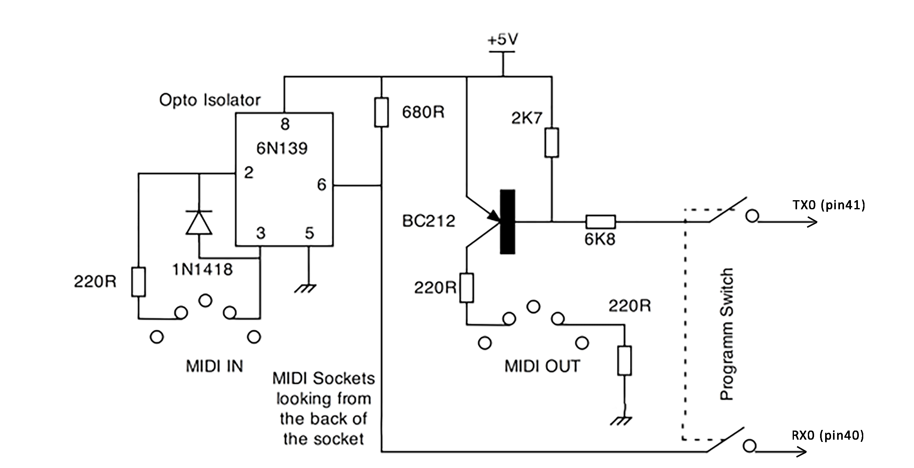

# MIDI I/O Shield (MIDI Interface)

Basically a MIDI signal looks like a normal serial signal but with different voltage characteristics and a non standard baud rate. Luckily in ESP32, there are **three serial ports** known as **U0UXD, U1UXD and U2UXD** all work at 3.3V TTL Level.

There are three hardware supported serial interfaces on the ESP32 known as UART0, UART1 and UART2. All three UART controllers are independent and fully featured (configurable parity bit, baud rate etc.). Like all peripherals, the pins for the UARTs can be logically mapped to any of the available pins on the ESP32. However, the UARTs can also have direct access which marginally improves performance.

## What's UART?

UART stands for Universal Asynchronous Receiver/Transmitter. It’s not a communication protocol like SPI and I2C, but a physical circuit in a microcontroller, or a stand-alone IC. A UART’s main purpose is to transmit and receive serial data.

The transmitting UART converts parallel data from a controlling device like a CPU into serial form, transmits it in serial to the receiving UART, which then converts the serial data back into parallel data for the receiving device. Only two wires are needed to transmit data between two UARTs. **Data flows from the Tx pin of the transmitting UART to the Rx pin of the receiving UART.**

UARTs transmit data **asynchronously**, which means there is no clock signal to synchronize the output of bits from the transmitting UART to the sampling of bits by the receiving UART. Instead of a clock signal, the transmitting UART adds **start and stop bits** to the data packet being transferred. These bits define the beginning and end of the data packet so the receiving UART knows when to start reading the bits. When the receiving UART detects a start bit, it starts to read the incoming bits at a specific frequency known as the **baud rate**. Baud rate is a measure of the speed of data transfer, expressed in bits per second (bps).

Both UARTs must operate at about the same baud rate. The baud rate between the transmitting and receiving UARTs can only differ by about 3% before the timing of bits gets too far off.

**U0UXD** is used to communicate with the ESP32 for programming and during reset/boot.

**U1UXD** is unused and can be used for useful work. The board we're using use this port for SPI Flash access though.

**U2UXD** is unused and can be used for useful work.

Therefore, we will be using U0UXD for MIDI I/O and U2UXD for communicating with the visualizer bars.

## Example Code

```Arduino
#define RXD2 16
#define TXD2 17

void setup() {
  // Note the format for setting a serial port is as follows: Serial2.begin(baud-rate, protocol, RX pin, TX pin);
  Serial.begin(115200);
  Serial2.begin(9600, SERIAL_8N1, RXD2, TXD2);
  Serial.println("Serial Txd is on pin: " + String(TX));
  Serial.println("Serial Rxd is on pin: " + String(RX));
}

void loop() {
  while (Serial2.available()) {
    Serial.print(char(Serial2.read()));
  }
}
```

This program reads data from serial2 and sends to serial0 i.e. programming serial.

## Schematic Analysis



Since we're using U0UXD port for MIDI I/O which is the same port used for programming the ESP32, a switch is required that effectively removes the MIDI interface connection into the ESP32 when we are programming or debugging. Otherwise, garbage data will be sent with the MIDI messages while transmitting and data can be corrupted when uploading while recieving MIDI messages.

The schematic is quite straight forward, on the transmit side the serial output is fed through a resistor to the base of a PNP transistor. These are sometimes called **upside down** transistors because a high voltage into it makes it stop conducting and a low voltage makes the collector / emitter conduct.

The output is then channeled through the MIDI receiving device through two 220Ohm resistors. In effect this is a current output as opposed to the more normal voltage output. On the receive side, the signal from the MIDI transmitting device is passed through a 6N139 opto isolator. This is basically a LED and a photo transistor in one package the only connection between the sending device and the arduino is a light path. There is a resistor to protect the input from too much current and a diode to protect against reverse voltage if for example we wired the MIDI leads up incorrectly. The photo transistor output is simply pulled up and fed into the receive pin of the Arduino.