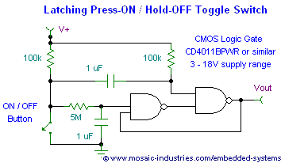

# Power Supply for Processing Unit and Visalizer Bar

## 3.7V to 5V Step-Up Boost Converter

This is the Step-Up DC-DC Boost converter module which provides 5V DC stable voltage output at various input ranges between 2.7V to 4.2V. This circuit boosts the voltage level and provides the amplified stabilized 5V output. The IC has a built in synchronizable oscillator whose frequency whose frequency can be adjusted from 300 KHz to 2 MHz. For the different input ranges, it consumes a different amount of current to produce a balanced output.

In the circuit LTC3440 is wired as a 5V boost converter capable of delivering a steady 5V output @ 300mA from an input voltage from 2.7 to 4.2 V.

## TP4056 Battery Charger Module

This 3.7V Battery Charger TP4056 module is made for charging rechargeable lithium batteries using the constant-current/constant-voltage (CC/CV) charging method. In addition to safely charging a lithium battery, TP4056 BMS Board also provides the necessary protection required by lithium batteries. The TP4056 is suitable for USB power and adapter power supplies. Due to the internal PMOSFET architecture and anti-reverse charging path, no external isolation diodes are required.

## Press ON - Hold OFF latching circuits

For controlling smart products containing microcontrollers you often want to ensure that the power is not inadvertently removed. Consequently, you want a power switch that can be turned ON by a brief button press, but requires a longer, deliberate button hold to turn it OFF. That prevents accidentally killing power if the tactile switch is unintentionally touched.

The following shows a NAND gate latch implementing the desired action:

When power is first applied, the output is held low for 3 seconds, during which time the button has no effect. After that, a momentary press latches the output high, and a long press of greater than 3 seconds latches the output low again. You can use the output to turn ON and OFF a variety of devices, including MOSFET hogh- or low-side switches. The output of the other NAND gate can be used if an inverted logic level is needed.

## Full Circuit Diagram

The Circuit Diagram for Power Supply Circuit for Processing Unit (+ the Visualizer Bar) with Battery Charger & Boost Converter is given below. The circuit can be powered using two methods, one with 9V/12V DC Adapter and other with 3.7V Lithium-Ion Battery.

For powering the Board using DC Jack, we have used DCJ0202 Female Jack. We used 470uF & 100uF Electrolytic Capacitor to avoid DC fluctuations and remove voltage spikes. The LM7805 Voltage regulator IC can take the input voltage from 7V to 35V. But is recommended to use the input voltage up to 15V only. With an increase in voltage, there is more heat dissipation that requires a bigger heat sink. **We are planning to handle the cooling inside the processing unit (if only necessary).** The output from the Voltage regulator is connected to the Vin pin of ESP32 & GND is connected to GND. Hence we can power up the module using 9V/12V DC Adapter too.

**For the visualizer bar, power will be transferred through USB.**