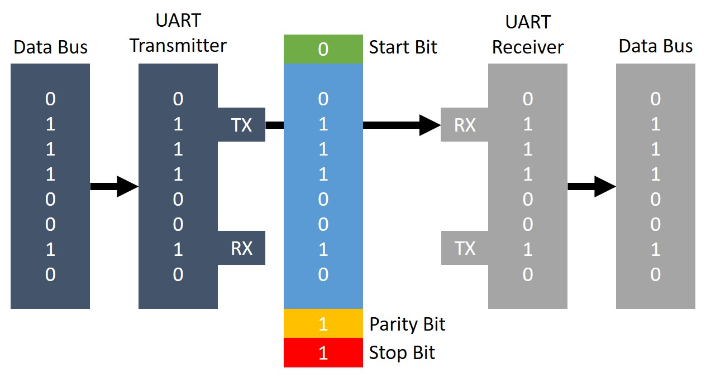

# Visualizer Block Communication

## Visualizer Block Schematic

All the operations in a Visualizer Block is handled by an **Arduino Pro Micro** inside. The reason for using an Arduino Pro Micro is that they come as two versions: 3.3V and 5V. Since the ESP32's working voltage is 3.3V, Arduino Pro Micro 3.3V will be compatible to communicate with it serially. Also, it consumes less power and the development board does not take much space. On the other hand, the serial port (pin 0 and pin 1) in Arduino Pro Micro is independent of the USB-Serial port that is used to communicate with PC. Therefore, we can use pin 0 and pin 1 for the Visualizer Block - Visualizer Block communication with no trouble since it won't interfere with the USB-Serial port.

The Arduino Pro Micro has 20 digital I/O pins. Therefore, it is more than enough to utilize 12 outputs for the 12 LEDs corresponding to the 12 different notes in an octave (C, C#, D, D#, E, F, F#, G, G#, A, Bb, B).

Unfortunately, the Pro Micro provides only one UART port. But we need two of them to communicate with each other. Therefore, we use the digital pins 3 as TX and 10 as RX with the **Arduino SoftwareSerial** library to replace the functionality.

## Communication

The communication between a Visualizer Block and another Visualizer Block or between a Visualizer Block and the processing unit is done **serially** via **UART communication protocol**.

UART, which stands for Universal Asynchronous Reception and Transmission, is a simple serial communication protocol that allows the host (Arduino Pro Micro or ESP32 in our case) to communicate with serial devices.

UART supports bidirectional, asynchronous and serial data transmission.

Before the UART device can send data, the transmitting device converts the data bytes to bits. After converting the data into bits, the UART device then splits them into **packets** for transmission. Each packet contains a start bit, a data frame, parity bit, and the stop bit. The data frame is usually 8 bits long. The following diagram shows an example data packet:

The following diagram shows how the data transmission and framing happens in UART communication protocol.

One advantage of UART is that only 2 wires are needed for the communication between master and slave device, because there is no need for a clock line and like SPI communication, there is also no slave select line. The 2 lines are: TX (transmission) and RX (reception).

### Our own communication protocol

The following diagram dipicts how the hardware communicates with each other.

We've made our own communication protocol to communicate with the Visualizer Blocks. The Processing Unit is referred to as the **Host** and the Visualizer Bar is referred to as the **Device**.

As shown in the above diagram, there are two types of communication: **Host-Device** communication and **Device-Device** communication. During data transmission, the sender will be the master and the reciever will the slave since in UART communication there'll always be 1 master and 1 slave. So, the transmissions are done in a **daisy chain** (several devices linked together serially) fashion.

When MIDI messages are recieved by the Processing Unit, it processes them and sends serial data packets to the appropriate Visualizer Block. The data packet won't arrive at the particular block directly, instead the packet will travel through all the blocks until the packet finds it's destination Visualizer Block.

Therefore, there's a need to define different kind of data packets (bit strings) that is responsible for different tasks. The reciever's id (or an address) and/or the sender's id also needs to be encapsulated in a data packet.

The types of packets we're using for host-device and device-device communication are as following:
1. Device notify packets.
2. Device discovery packets.
3. Host notify packets.
4. Control information packets.

To indicate which packet is which, we will include two bits (for now) of information to store the **action** of the packet.

<table>
  <tr>
    <th>action</th>
    <th>Description</th>
  </tr>
  <tr>
    <td>00</td>
    <td>Device Notify</td>
  </tr>
  <tr>
    <td>01</td>
    <td>Device Discovery</td>
  </tr>
  <tr>
    <td>10</td>
    <td>Host Notify</td>
  </tr>
  <tr>
    <td>11</td>
    <td>Control Information</td>
  </tr>
</table>

A packet in general will be as follows:

**When the processing unit is powered on**, it will wait until the visualizer bar to be connected. The processing unit waits for a **Device Notify: Connected** packet (i.e. until there's an available visualizer bar connection. When a visualizer block is connected, it sends a **Device Notify: Connected** packet to the device at the right side of it). The LED ring will flash periodically to indicate that the visualizer bar needs to be connected. When it is connected to the visualizer bar, the LED ring will be turned off to indicate that the **Device Discovery** is on progress. When the processing unit recieves a Device Notify: Connected packet, it sends a **Device Discovery** packet containing it's ID (all 1s) and the destination id (the visualizer block id) set to be 0 initially.

### The Device Discovery Phase

The device discovery happens as following:
1. The processing unit sends a device discovery packet containing the block_id (reciever's id) initialized to 0, to the visualizer bar. The sender's id will be all 1's to indicate that it's the processing unit that sends the packet.
2. The very first visualizer block that is directly connected to the processing unit will receive the packet and will assign the block_id to itself. Then it'll set the sender's id as the block_id that it just assigned, increment the block_id and will send another device discovery packet to the next visuzlier block that is connected to it.
3. So on and so forth this will happen until the packet reaches the last visualizer block. Because of the **Device Notify: Connected** packets that were initially sent. The last block knows that nothing is connected to the left side of it and thus it is the last block. Therefore, this block will send a **Host Notify: Discovery Finished** packet with sender's id being the final value of the block id (block id of the last visualizer block) and the reciever's id being all 1s back to the processing unit.

**Host Notify** packets won't be modified by any of the recieving devices and will be forwarded until the packet reaches the processing unit.

When the host recieves the **Host Notify: Discovery Finished** message, it is ready for the next stage: **Callibration**.

### Callibrating the Visualizer Bar

Callibrating pretty simple, the LED ring will flash twice periodically when the Device Discovery is finished, indicating that the user needs to press the first key that the first visualizer block (in terms of the block id, the last visualizer block) covers.

Then, the processing unit will map each key to each visualizer block and store those information. So, when a MIDI message arrives at the processing unit, it can process the message and find which block covers that particular key in the MIDI message and send the Control Information packet to that Visualizer Block.

**NOTE:** If the visualizer block positions have been changed, the user can recallibrate by tapping the command button twice on the processing unit.

After the callibration is done, the system is ready.