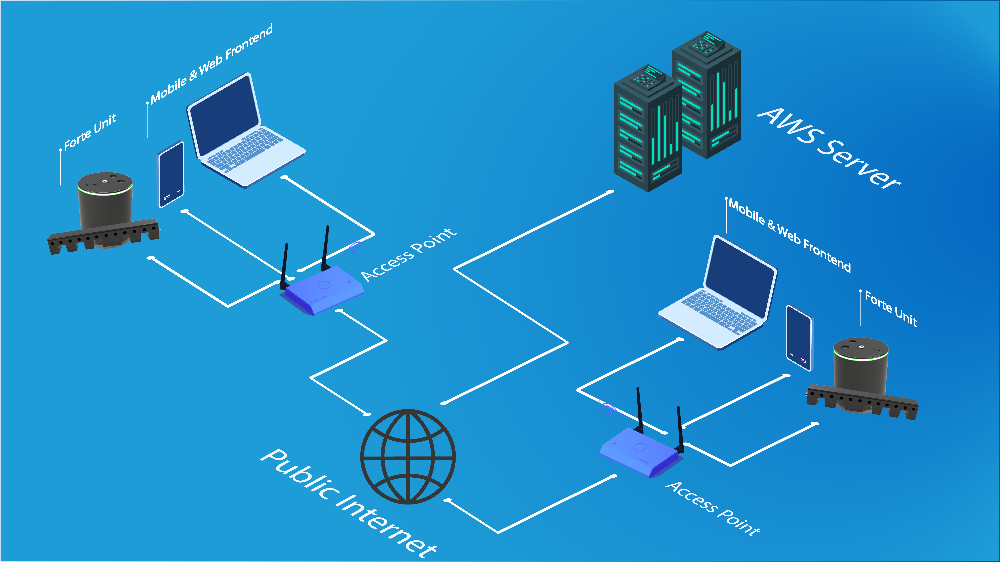
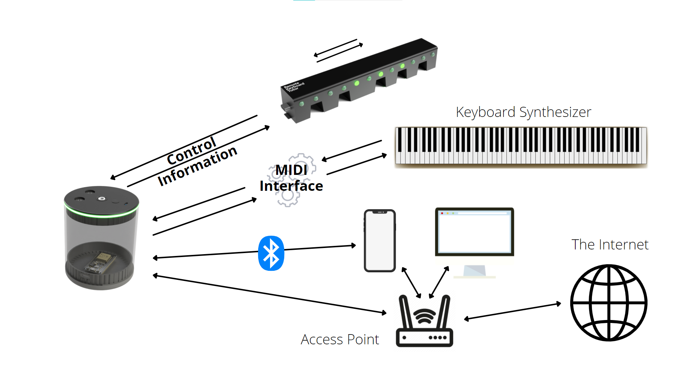
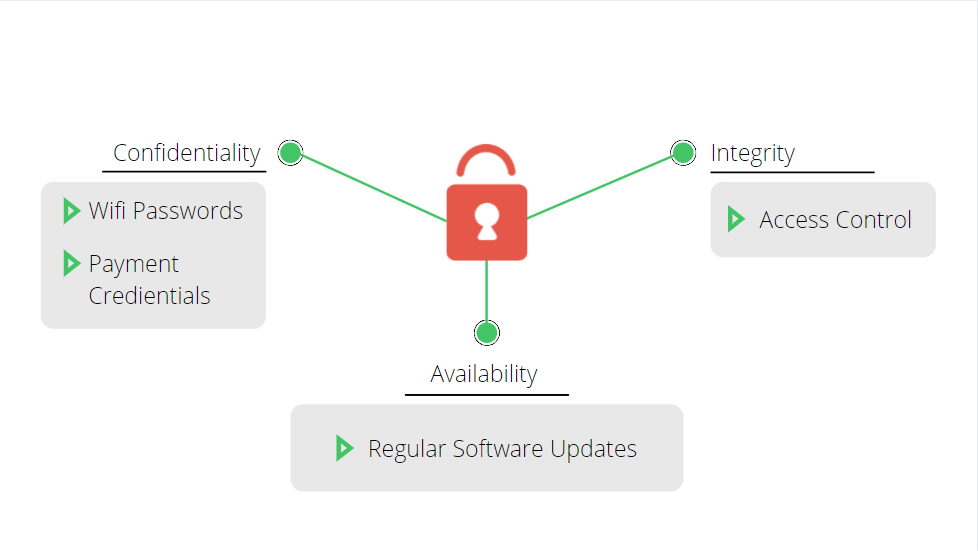
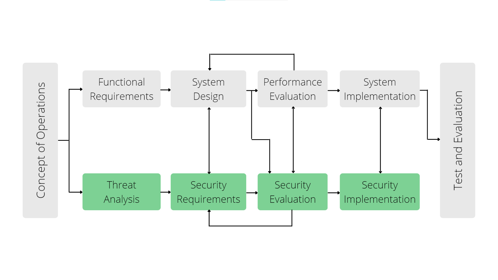
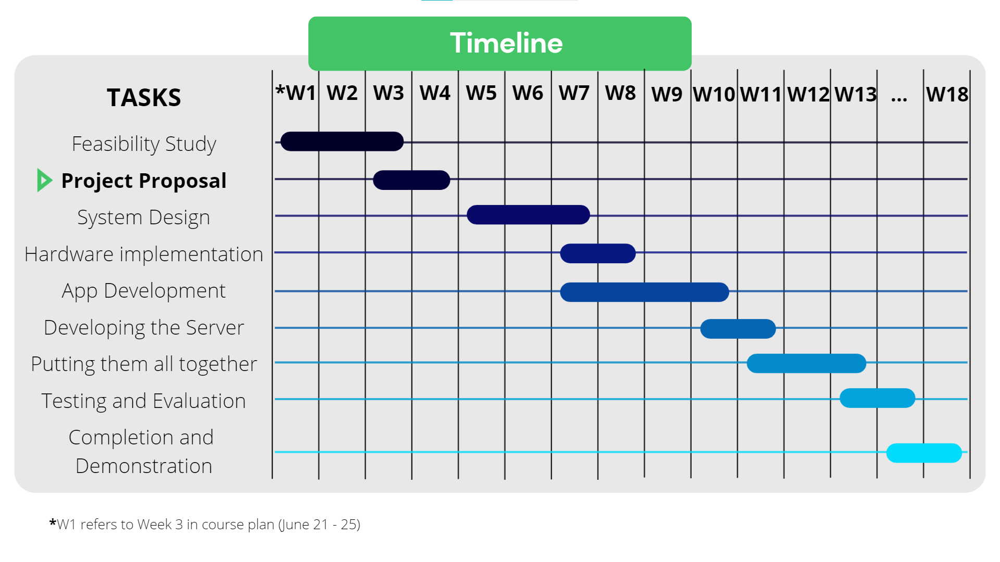
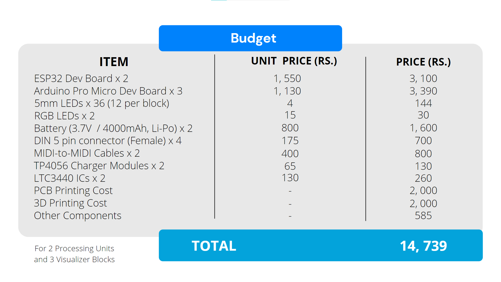

# Remote Keyboard Tutoring System

## Table of Contents
  - [Remote Keyboard Tutoring System](#remote-keyboard-tutoring-system)
  - [Table of Contents](#table-of-contents)
  - [Problem Overview](#problem-overview)
  - [Already Existing Approaches](#already-existing-approaches)
  - [Our Solution](#our-solution)
  - [Solution Architecture](#solution-architecture)
  - [Backend](#backend)
  - [Hardware Functionalities](#hardware-functionalities)
  - [Planned Features](#planned-features)
  - [Security Aspects](#security-aspects)
  - [Proposed Timeline](#proposed-timeline)
  - [Estimated Budget](#estimated-budget)
  - [Feedback](#feedback)
  - [Related Links](#related-links)

## Problem Overview

Piano is the most admired musical instrument so far. Over 25% of the world population fancy playing it. Yet not everyone is fortunate to learn from the best. This has fabricated a vast difference in the skill level of people who are playing the piano. The reason would be that most of the experts in the field lives in either the western hemisphere or east Asia. Even local experts aren't scattered throughout the island. So most of them tend to make use of the online procedures to teach piano. The current online methods would be using a platform like zoom and an app that simulates what one plays from his instrument.  Or else the student self learns just using an online app or tutorials. This hasn't shown profound results since the teacher or the student has problems when showing what he's playing on the piano in real time. The accuracy of the app isn't acceptable and the relationship between the student and the teacher isn't sturdy like in a live class room. Following problems occur due to an absence of a well-established remote method to teach or lean piano.

* A piano player has to be subtle. Several skills like hand / eye coordination, finger patterns, timing should be handled precisely.

* If teacher uses the online video streaming method to show what he plays on his piano, he might have to use several accessories (Ex: One camera to show his hand coordination, one camera to show his postures, a quality mic).

* People with a great potential might give up due to current ineffective ways to learn piano / keyboard online or not having a professional piano player to learn from his current location of residence.

## Already Existing Approaches

When it comes to online piano tutoring apps there are many popular apps for self-learning. Some of the popular apps are:

* [Skoove](https://www.skoove.com/en)
* [Yousician](https://yousician.com/)
* [Simply piano](https://www.joytunes.com/simply-piano)
* [Online Pianist](https://www.onlinepianist.com/)

All of them uses simulated keyboards to show the notes that the leaner should play and most of them uses the phone mic to get inputs to the app and give feedback to the player. These aren’t very accurate at giving you feedback since they can’t accurately identify the notes just using the microphone. The above applications _do not focus on remote real-time teaching_.

However, there are systems called [Piano Player Systems](https://www.amromusic.com/player-piano-systems) (or self playing pianos) which sort of do implement the above mentioned functionality. One example would be the [PianoDisc Piano Player](https://pianodisc.com/). These systems are mainly based on Pianos and not Keyboard Synthesizers. Thus, not everyone is able to afford those. Even though these systems can be used for remote tutoring purpose, they are mainly designed for entertainment purpose.

## Our Solution

The solution we present is a web based system that can be attached to any keyboard synthesizer through a MIDI connector (Legacy or USB). Thus, the only requirement for the keyboard is MIDI support. Once our system is connected to the keyboard, the user can interactively learn, play or teach in combination with the web application that we provide. The user has to be logged in as either a typical user or an expert depending on the user's needs. Users can get connected to each other in the network and they can share their music with each other. Users can play shared music in their own keyboard and join to experts to learn remotely in real-time. The tutor can handle multiple students at a time. When the tutor plays on the keyboard, those notes will be displayed and played in the students keyboards simultaneously. Tutor can upload exercises and when a student plays incorrectly, the wrong key presses will be displayed to both the student and the tutor.

## Solution Architecture

Our system consists of two devices: the _Pocessing Unit_ and the _Visualizer Bar_ which is a composition of _Visualizer Blocks_.

Processing Unit             |  Visualizer Bar
:--------------------------:|:-------------------------:
|  

The **Processing Unit** handles all the data processing and remote communications. It has two MIDI interfaces (one for MIDI-in and the other for MIDI-out) as well as two USB-C ports. The other USB port is to connect the visualizer bar in.

The **Visualizer Bar** is where all the key press information will be displayed at. The bar has to be placed on the keyboard near the end where the key hinges are. We provide the visualizer bar as easy-to-connect blocks in order for our product to fit any kind of keyboard and to make our product portable. The three common keyboard sizes are 61-keys, 76-keys and 88-keys. Therefore, the blocks are such that it covers an octave. Since blocks might not cover the whole keyboard, we provide the visualizer bar as a whole for the most common keyboard sizes as well. The visualizer bar has a USB-C port at the right end to connect in to the processing unit. The visualizer blocks have magnetic ends to stay still when they're connected. Left end of a block has a female USB-C port and the right end has a male USB-C connection. The bar has RGB leds representing each key and they will lit according to the key presses.

The above diagram shows an abstract diagram of how our system works.
Our solution consists of two main components: The Pocessing Unit and the Visualizer Bar 
The processing unit is connected to the keyboard via the MIDI interface and the processing unit is connected to the visualizer bar via a USB-C interface. The processing unit has inbuilt WI-FI as well as Bluetooth so the processing unit can directly connected to our server via a home router and exchange MIDI data with the server and with a another processing unit if they are connected in a same session. In order to communicate with the server we are going to implement a mobile as well as a web interface.

## Frontend

For our frontend web platform would be implemented using React.js. React will assure a fast and easy development of the frontend since React provides lots of readymade components to use and React uses javascript it will be easier to coordinate with the backend as well. Other than that React apps can be made SEO friendly by making them server-side rendered rather than client-side rendered.
Our frontend mobile platform will be implemented using Flutter since it also provides a lot of components to use and Flutter performs well in a lot of mobile devices. Since Flutter uses Dart as the programming language we can use the same codebase for both ios and android applications.
[Click here](./web-app) to see what we have done up to now in the web frontend.
[Click here](./Mobile%20App/rkt_mobile) to see what we have done so far in the mobile frontend. 

## Backend

Our backend computing platform would be Node.js along with express as the framework. It'll assist us in hadling multiple online requests and the working environment will be more effective and better-coordinated since javascript laguage is used in both frontend and backend development. MongoDB will be used as our database system. As the number of users for our product increase, it is very much practical to use MongoDB since it is very easy to scale up or down. MongoDB works on all types of cloud platforms. Since we'll be using aws to host our services MongoDB will be a great choice. NGINX is used as a reverse proxy so we can get access through http, https and Let's Encrypt is used to get free SSL certificates. All our backend services will be hosted using AWS services. An AWS EC2 instance is used run all the processes and AWS backup will be used to automate and manage backups. 

[click here](./server/src) to see what we have done so far.

## Hardware Functionalities

When it comes to hardware used in our embedded system, the brain of our processing unit is the **ESP32 Development board**. There are several reasons why we chose this board over other alternatives: built-in Wifi connectivity with 150Mbps data rate, integrated Bluetooth low energy (BLE) connectivity very small and compact board and the power consumption is less. As shown in the above high-level diagram, we need to have a MIDI interface in between the visualizer bar and the keyboard synthesizer for communicating with **MIDI messages** ([What is MIDI?](https://github.com/cepdnaclk/e17-3yp-remote-keyboard-tutoring-system/tree/main/Research/MIDI%20Technology)). The processing unit will be connected to Wifi as well as to the mobile phone via bluetooth. We use this BT connection for the offline helper as well as to authenticate to a Wifi router.

When MIDI messages arrive at the processing unit either from the user's keyboard or from remotely through the server, the microcontroller will process them and send control signals to the visualizer bar appropriately. The  communication between the visualizer bar and the processing unit will happen via an USB interface through a wired connection. The visualizer bar will also need to send signals to the processing unit because in order to light up the correct key on the keyboard, the processing unit needs to know the positional information of the particular visualizer block. So, before the user starts using the system he needs to do a very simple calibration procedure: play both the first note and the last note one after the other that the visualizer bar covers when the app prompts and thereafter the processing unit will memorize which block is where. In order to achieve this, the visualizer bar will also require a microcontroller. We will be using an arduino pro micro for this purpose.

## Planned Features

* Low latency real-time key press indication.
* Easy to setup / connect.
* The visualizer bar will be non-disturbing to the user and it will also add some aesthetics to the keyboard.
* The system will support any kind of non-standard keyboard as long as the keyboard has MIDI support.
* Students can easily find teachers available near their area.
* Classes can be scheduled through the application.
The web application allows teachers to upload exercises which will be played on student’s keyboard as MIDI so that the students can go along with and practise.
* Students can record what they’re playing and submit to the teacher in order to evaluate their work.
* An offline helper which can give assistance with the exercises.
* Efficient real-time Video & Audio Streaming for classes.
* Posture tracking for improving student's posture while playing.
* Finger tracking to check if the students are following the correct hand posture.

Current progress on implemented features can be seen [here](https://github.com/cepdnaclk/e17-3yp-remote-keyboard-tutoring-system/tree/main/web-app)

## Security Aspects

Cybersecurity of connected embedded system devices has always been important. Since our system also involves sharing private information through the internet like passwords and online payments, we have taken extra care to ensure the security of the system. The following diagram shows how we have designed our system to ensure the CIA triad.

The following diagram shows our secure embedded system design process. The gray color path is the ideal embedded system design process that anyone would follow. In addition to that, we have added a security approach that'll happen in parallel with the embedded system design process. Starting from our concept of operations, we will do a threat analysis while collecting the functional requirements to analyze the potential attacks that the system may be subjected to when deployed. The next step is to specify how our demand measures the security requirements of the system. Once we have the security requirements, we will start developing the security approach after some rounds of evaluations.

## Proposed Timeline

## Estimated Budget

## Feedback

✨ If you have any questions or suggestions for improvement regarding our project, feel free to share them [here](https://padlet.com/sathiiii/RKT_Discussion).✨

## Related Links

[University of Peradeniya](https://www.pdn.ac.lk/academics/academics.php/)

[Faculty of Engineering](http://eng.pdn.ac.lk/)

[Department of Computer Engineering](http://www.ce.pdn.ac.lk/)
