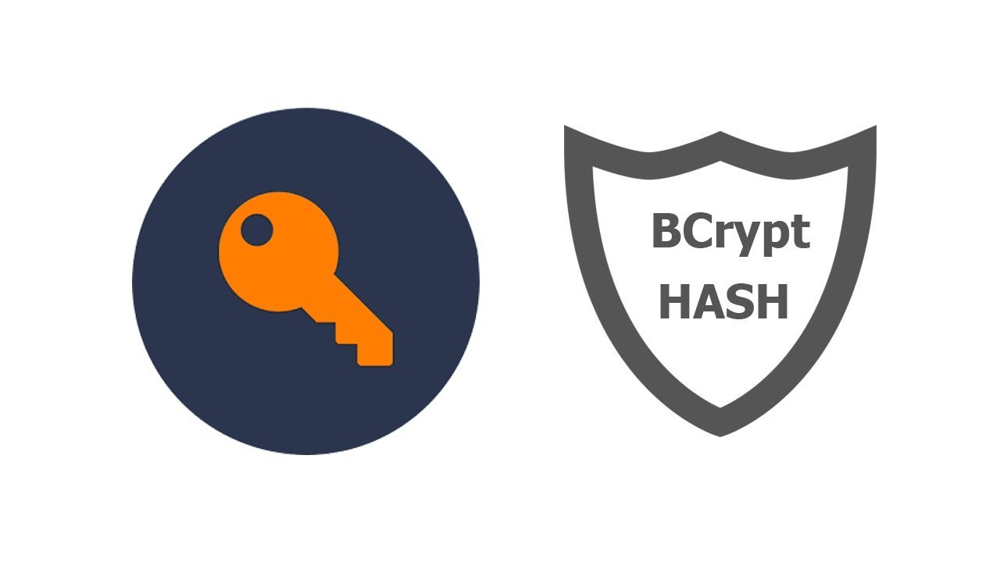
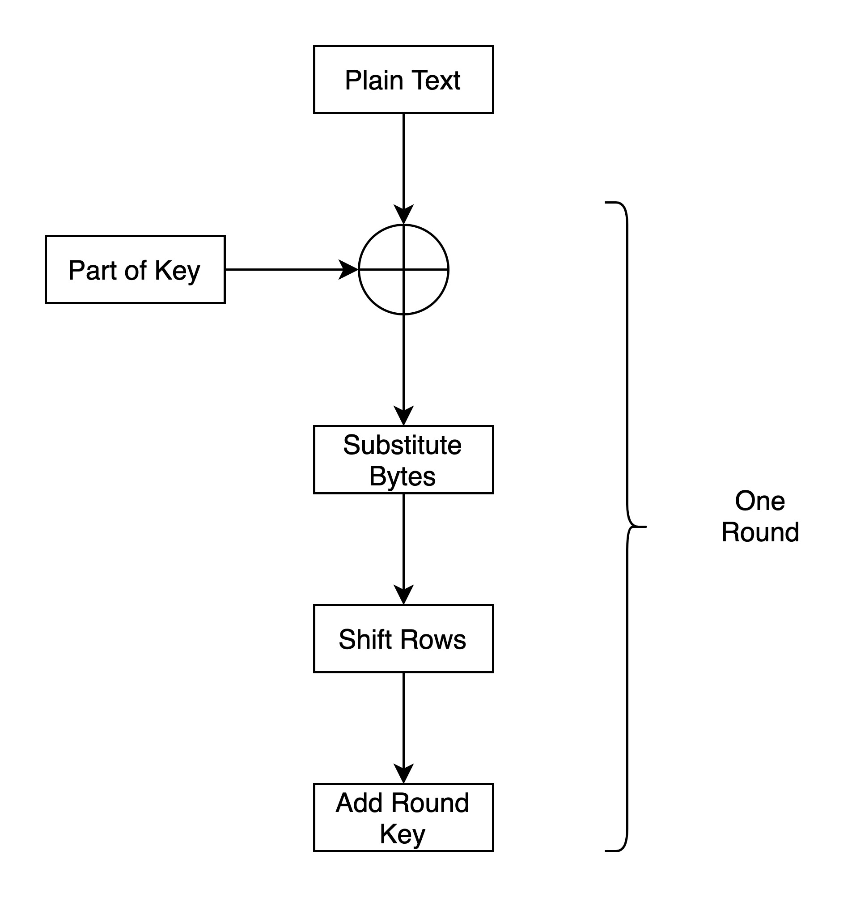
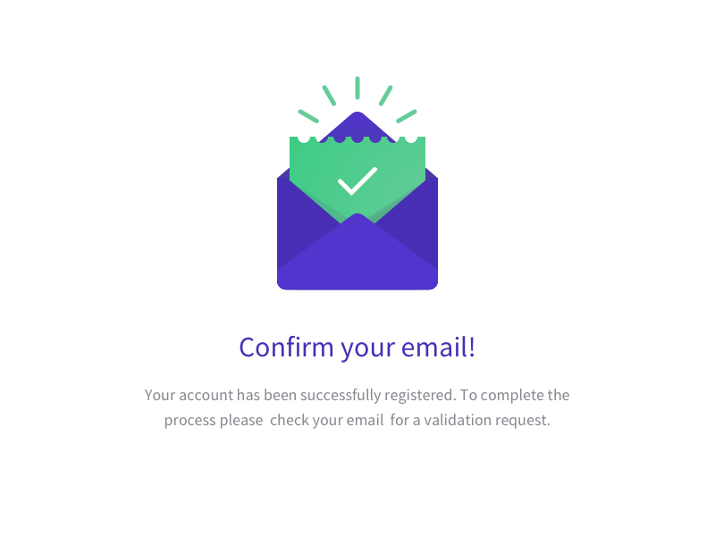

# Bcrypt

Storing passwords in plaintext must never be an option. Instead, we want to provide a one-way road to security by hashing passwords. Hashing alone is not sufficient to mitigate more involved attacks such as rainbow tables. A better way to store passwords is to add a salt to the hashing process (adding additional random data to the input of a hashing function that makes each password hash unique).

The bcrypt hashing function (based on the Blowfish cipher) allows us to build a password security platform that scales with computation power and always hashes every password with a salt.

# AES Encryption

AES data encryption is a more mathematically efficient and elegant cryptographic algorithm, but its main strength rests in the option for various key lengths. AES allows you to choose a 128-bit, 192-bit or 256-bit key, making it exponentially stronger. It uses permutation-substitution, which involves a series of substitution and permutation steps to create the encrypted block. Block size is 128 bits and they are arranged in 4x4 grids.

The following figure shows a single round in AES.

Substitution of bytes is done using a celevrly built lookup up table. Rows in the grids are shifted as follows,

1st row - no shift  
2nd row - shift left by 1 
3rd row - shift left by 2 
4th row - shift left by 3 

# Email Confirmation

Email confirmation is done to avoid spam and to verify whether people are using actual emails.

# Security in Amazon EC2

Cloud security at AWS is the highest priority. An AWS customer, benefit from a data center and network architecture that are built to meet the requirements of the most security-sensitive organizations.AWS is responsible for protecting the infrastructure that runs AWS services in the AWS Cloud. AWS also provides you with services that you can use securely. Third-party auditors regularly test and verify the effectiveness of our security as part of the AWS Compliance Programs