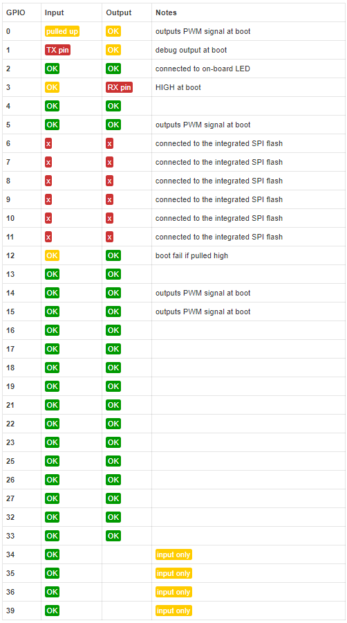
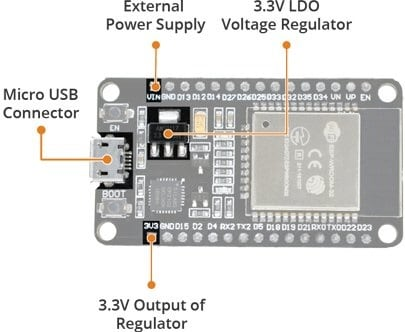
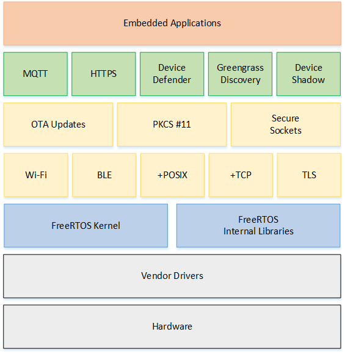

# ESP-32 Development Board

[Official Documentation](https://docs.espressif.com/projects/esp-idf/en/latest/esp32/)

## Introduction

ESP32 is a system on a chip that integrates the following features:

* Wi-Fi (2.4 GHz band, 150.0 Mbps data rate with HT40)
* Bluetooth (BLE - Bluetooth Low Energy and Bluetooth Classic)
* Dual high performance Xtensa® 32-bit LX6 CPU cores  running at 160 or 240 MHz
* Ultra Low Power co-processor
* Flash memory (4 MB)
* 32-bit SRAM
* Multiple peripherals
* Security: hardware accelerators for AES and SSL/TLS
* Arduino IDE compatible
* Low Power: ensures that you can still use ADC conversions, for example, during deep sleep

Powered by *40 nm technology*, ESP32 provides a robust, highly integrated platform, which helps meet the continuous demands for **efficient power usage**, **compact design**, **security**, **high performance**, and **reliability**.

The ESP32 can be programmed in different programming environments, including:

* Arduino IDE
* Espressif IDF (IoT Development Framework)
* Micropython
* JavaScript
* LUA

Espressif provides basic hardware and software resources to help application developers realize their ideas using the ESP32 series hardware. The software development framework by Espressif is intended for development of Internet-of-Things (IoT) applications with Wi-Fi, Bluetooth, power management and several other system features.

## ESP32 Peripherals

The ESP32 peripherals include:

* 18 Analog-to-Digital Converter (ADC) channels
* 3 SPI interfaces
* 3 UART interfaces
* 2 I2C interfaces
* 16 PWM output channels
* 2 Digital-to-Analog Converters (DAC)
* 2 I2S interfaces
* 10 Capacitive sensing GPIOs

The ADC (analog to digital converter) and DAC (digital to analog converter) features are assigned to specific static pins. However, you can decide which pins are UART, I2C, SPI, PWM, etc – you just need to assign them in the code. This is possible due to the ESP32 chip’s multiplexing feature.

Although you can define the pins properties on the software, there are pins assigned by default as shown in the following figure (this is an example for the ESP32 DEVKIT V1 DOIT board with 36 pins – the pin location can change depending on the manufacturer).


Additionally, there are pins with specific features that make them suitable or not for a particular project. The following table shows what pins are best to use as inputs, outputs and which ones you need to be cautious.

The pins highlighted in green are OK to use. The ones highlighted in yellow are OK to use, but you need to pay attention because they may have an unexpected behavior mainly at boot. The pins highlighted in red are not recommended to use as inputs or outputs.



GPIOs 34 to 39 are GPIs – input only pins. These pins don’t have internal pull-up or pull-down resistors. They can’t be used as outputs, so use these pins only as inputs:
* GPIO 34
* GPIO 35
* GPIO 36
* GPIO 39

## Power Requirements

The ESP32 Board operates between 2.2V to 3.6V. But we supply 5V from Micro-USB port. For 3.3V there is already an LDO voltage regulator to keep the voltage steady at 3.3V. ESP32 can be powered using Micro USB port and VIN pin (External Supply Pin).



The power required by ESP32 is 600mA, as ESP32 pulls as much as 250mA during RF transmissions. During boot or wifi operation it’s drawing more than 200mA current. Thus supply power from Micro-USB Cable is not enough for ESP32 Board when we are adding multiple sensors or modules to the Board. This is because Computer USB port can provide less than 500mA of current.

## ESP-IDF (IoT Development Framework)

ESP-IDF is Espressif’s open-source official IoT Development Framework for the ESP32 series. It provides a self-sufficient SDK for any generic application development on these platforms, using programming languages such as C and C++. ESP-IDF supports a large number of software components, including RTOS, peripheral drivers, networking stack, various protocol implementations, and helpers for common application use-cases.

The framework also consists security of features such as hardware-backed security features, such as flash encryption and secure boot, cryptographic accelerator support for RSA, SHA and AES, libsodium and micro-ecc cryptographic libraries.

ESP-IDF supports IDEs such as Visual Studio Code ([Visual Studio Code Extension](https://github.com/espressif/vscode-esp-idf-extension), [Quick User Guide for the ESP-IDF VS Code Extension](https://youtu.be/Lc6ausiKvQM)) and Eclipse ([Eclipse IDE plugin](https://github.com/espressif/idf-eclipse-plugin)).

## ESP-IDF vs Arduino-ESP32

Arduino-ESP32 library is just a wrapper around the esp-idf mainly simplifying things and making it integrated with the design paradigms of arduino as a whole.

One can use the arduino version for the same reason that he would use arduino as a whole, namely for its low barrier to entry, extensive ecosystem/support, and ease of use. But he's not going to get the best performance, have the most maintainable/extensible code, or be able to take full advantage of the peripherals.

Firstly, arduino kind of pushes you in the wrong direction for serious embedded development, artificially confining you to a **setup and loop function**, when in reality it should be more focused on **compartmentalization of function into a task based application**. This is essentially what arduino-esp32 does under the hood, but you wouldn't know unless started to look into the idf yourself.

Secondly, being able to work directly with the idf means that you can actually understand errors that you get when you start combining peripherals or calling idf functions. You can call idf functions in arduino-esp32, but it is much easier to directly use the idf, be familiar with the api reference, and work directly with the source than having to translate everything through the wrapper functions when debugging something.

Thirdly, the idf runs **freeRTOS (free Real-Time Operating System)** (an operating system that runs code as **tasks**) which is pretty widespread in embedded systems, so the techniques and knowledge you gain will translate pretty well to other MCUs if you ever work with any others. This is where the idea of having **tasks and message passing between tasks** as opposed to a "**superloop**" comes from. You could do a super loop just as well in freeRTOS, but it is really designed to be more task based. Further, the idf has the design pattern of components which allow you to split off functionality into their little compartments, allowing large projects to be much easier to organize.

[~source](https://www.reddit.com/r/esp32/comments/dk3rsn/why_idf_vs_arduino_ide/)

## FreeRTOS Architecture



## FreeRTOS Kernel Fundamentals

The Espressif Internet Development Framework (ESP-IDF) uses FreeRTOS to make better use of the two high speed processors and manage the numerous built-in peripherals. It is done by creating tasks.

The FreeRTOS kernel provides,
* A multitasking scheduler.
* Multiple memory allocation options (including the ability to create completely statically-allocated systems).
* Intertask coordination primitives, including task notifications, message queues, multiple types of semaphore, and stream and message buffers.

The FreeRTOS kernel is designed to be small, simple, and easy to use. A typical RTOS kernel binary image is in the range of 4000 to 9000 bytes.

### Kernel Memory Allocation

The RTOS kernel needs RAM each time a task, queue, or other RTOS object is created. The RAM can be allocated:

* Statically at compile time.
* Dynamically from the RTOS heap by the RTOS API object creation functions.

When RTOS objects are created dynamically, using the standard C library malloc() and free() functions is not always appropriate for a number of reasons:

* They might not be available on embedded systems.
* They take up valuable code space.
* They are not typically thread-safe.
* They are not deterministic.

For these reasons, FreeRTOS keeps the memory allocation API in its **portable layer**. The portable layer is outside of the source files that implement the core RTOS functionality, so you can provide an application-specific implementation appropriate for the real-time system you're developing. When the RTOS kernel requires RAM, it calls pvPortMalloc() instead of malloc(). When RAM is being freed, the RTOS kernel calls vPortFree() instead of free().

### Application Memory Management

When applications need memory, they can allocate it from the FreeRTOS heap. FreeRTOS offers several heap management schemes that range in complexity and features. You can also provide your own heap implementation.

The FreeRTOS kernel includes five heap implementations:

**heap_1**
Is the simplest implementation. Does not permit memory to be freed.

**heap_2**
Permits memory to be freed, but not does coalesce adjacent free blocks.

**heap_3**
Wraps the standard malloc() and free() for thread safety.

**heap_4**
Coalesces adjacent free blocks to avoid fragmentation. Includes an absolute address placement option.

**heap_5**
Is similar to heap_4. Can span the heap across multiple, non-adjacent memory areas.

## Hello World

The following is the structure of ESP-IDF:

>+--esp-idf<br>
&nbsp;&nbsp;&nbsp;&nbsp;	|<br>
&nbsp;&nbsp;&nbsp;&nbsp;	+ - - components<br>
&nbsp;&nbsp;&nbsp;&nbsp;	|<br>
&nbsp;&nbsp;&nbsp;&nbsp;	+ - - docs<br>
&nbsp;&nbsp;&nbsp;&nbsp;	|<br>
&nbsp;&nbsp;&nbsp;&nbsp;	+ - - examples<br>
&nbsp;&nbsp;&nbsp;&nbsp;	|<br>
&nbsp;&nbsp;&nbsp;&nbsp;	+ - - make<br>
&nbsp;&nbsp;&nbsp;&nbsp;	|<br>
&nbsp;&nbsp;&nbsp;&nbsp;	+ - - tools<br>

The components directory holds all the 'C' code for the ESP32. It contains all the **components** that make up the ESP32. It includes Drivers for numerous peripherals, the bootloader, bt(bluetooth), freeRTOS etc.

### The Includes

```C
#include <stdio.h>
#include "freertos/FreeRTOS.h"
#include "freertos/task.h"
#include "esp_system.h"
#include "esp_log.h"
```

* freertos/FreeRTOS.h : Inclusion of this sets configuration required to run freeRTOS on ESP32.
* freertos/task.h: The tasks as you can guess provide the multitasking functionality.
* esp_system.h: This inclusion configures the peripherals in the ESP system. Think of it as system initialization. It's like setting up all the components of your bike, before you could fire the engine!
* esp_log.h: This is the logging library. It's used to log information to the serial port.

### The main() function

Unlike normal FreeRTOS tasks (or embedded C main functions), the **app_main** task is allowed to return. If this happens, The task is cleaned up and the system will continue running with other RTOS tasks scheduled normally. Therefore, it is possible to implement app_main as either a function that creates other application tasks and then returns, or as a main application task itself. app_main is called from a task called main_task spawned in cpu_start.c.

```C
void app_main()
{
    nvs_flash_init();
    xTaskCreate(&hello_task, "hello_task", 2048, NULL, 5, NULL);
}
```

* **Initialize Flash: nvs_flash_init()**: Non-volatile storage (NVS) library is designed to store key-value pairs in flash. This API initialises the default NVS partition.
* **xTaskCreate**: Creates a new task and adds it to the list of tasks that are ready to run. Following is the function prototype:
<br>BaseType_t xTaskCreate(TaskFunction_t pvTaskCode,
&nbsp;&nbsp;&nbsp;&nbsp;&nbsp;&nbsp;&nbsp;&nbsp;const char * const pcName,
&nbsp;&nbsp;&nbsp;&nbsp;&nbsp;&nbsp;&nbsp;&nbsp;configSTACK_DEPTH_TYPE usStackDepth,
&nbsp;&nbsp;&nbsp;&nbsp;&nbsp;&nbsp;&nbsp;&nbsp;void *pvParameters,
&nbsp;&nbsp;&nbsp;&nbsp;&nbsp;&nbsp;&nbsp;&nbsp;UBaseType_t uxPriority,
&nbsp;&nbsp;&nbsp;&nbsp;&nbsp;&nbsp;&nbsp;&nbsp;TaskHandle_t *pxCreatedTask);
<br>**pvTaskCode**: Pointer to the task entry function.
<br>**pcName**: A descriptive name for the task. This is mainly used to facilitate debugging, but can also be used to obtain a task handle.
<br>**usStackDepth**: The number of words (not bytes!) to allocate for use as the task's stack. For example, if the stack is 16-bits wide and usStackDepth is 100, then 200 bytes will be allocated for use as the task's stack. As another example, if the stack is 32-bits wide and usStackDepth is 400 then 1600 bytes will be allocated for use as the task's stack.
<br>**pvParameters**: A value that is passed as the paramater to the created task. If pvParameters is set to the address of a variable then the variable must still exist when the created task executes - so it is not valid to pass the address of a stack variable.
<br>**uxPriority**: The priority at which the created task will execute.
<br>**pxCreatedTask**: Used to pass a handle to the created task out of the xTaskCreate() function. pxCreatedTask is optional and can be set to NULL.

### The hello_task()

The function that is called from the task created above is a simple function as shown below. It simply prints the string to the UART. The Print stream is configured to the UART0 of the ESP32.

```C
void hello_task(void *pvParameter)
{
    printf("Hello world!\n");
    for (int i = 10; i >= 0; i--) {
        printf("Restarting in %d seconds...\n", i);
        // Delay a task for a given number of ticks.
        vTaskDelay(1000 / portTICK_RATE_MS);
    }
    printf("Restarting now.\n");
    fflush(stdout);
    // Software restart.
    esp_restart();
}
```

### The Complete Code

```C
#include <stdio.h>
#include "freertos/FreeRTOS.h"
#include "freertos/task.h"
#include "esp_system.h"
 
void hello_task(void *pvParameter)
{
    printf("Hello world!\n");
    for (int i = 10; i >= 0; i--) {
        printf("Restarting in %d seconds...\n", i);
        vTaskDelay(1000 / portTICK_RATE_MS);
    }
    printf("Restarting now.\n");
    fflush(stdout);
    esp_restart();
}
 
void app_main()
{
    nvs_flash_init();
    xTaskCreate(&hello_task, "hello_task", 2048, NULL, 5, NULL);
}
```

## Multitasking: Hello World with Blink

It is easy to accomplish that using the RTOS. The code below, creates two tasks. It can be thought of as these are two infinite (while) loops. _Whenever one enters delay state (vTaskDelay function), the other runs and vice-versa_. Since we are slow and ESP32 is fast, it switches between the tasks numerous times and we see both the tasks happening simultaneously.

```C
#include <stdio.h>
#include "freertos/FreeRTOS.h"
#include "freertos/task.h"
#include "esp_system.h"
// Allows to manage General Purpose I/O pins via simple and portable APIs.
#include "driver/gpio.h"
#include "nvs_flash.h"

#define BLINK_GPIO 2
 
void hello_task(void *pvParameter)
{
	while(1)
	{
	    printf("Hello world!\n");
	    vTaskDelay(100 / portTICK_RATE_MS);
	}
}

void blinky(void *pvParameter)
{
    gpio_pad_select_gpio(BLINK_GPIO);
    /* Set the GPIO as a push/pull output */
    gpio_set_direction(BLINK_GPIO, GPIO_MODE_OUTPUT);
    while(1) {
        /* Blink off (output low) */
        gpio_set_level(BLINK_GPIO, 0);
        vTaskDelay(1000 / portTICK_RATE_MS);
        /* Blink on (output high) */
        gpio_set_level(BLINK_GPIO, 1);
        vTaskDelay(1000 / portTICK_RATE_MS);
    }
}
 
void app_main()
{
    nvs_flash_init();
    xTaskCreate(&hello_task, "hello_task", 2048, NULL, 5, NULL);
    xTaskCreate(&blinky, "blinky", 512,NULL,5,NULL );
}
```

On FreeRTOS, tasks have an assigned priority which the scheduler uses to decide which task will run. High priority tasks ready to run will have preference over lower priority tasks, which means that as long as a higher priority task can run, a lower priority task will not have the CPU.

## Utilizing multiple cores

FreeRTOS tasks can be pinned to a specific core too. Note that, when we create a task with the xTaskCreate function, we are not specifying any particular core for it to run. So, FreeRTOS will run the task on the core that is free.

To know in which core a task is running, the **xPortGetCoreID()** function can be used.

Tasks can be pinned to a specific core using the **vTaskCreatePinnedToCore** function. This function takes exactly the same arguments of the xTaskCreate and an additional argument at the end to specify the core where the task should run.

```C
xTaskCreatePinnedToCore(
                    coreTask,   /* Function to implement the task */
                    "coreTask", /* Name of the task */
                    2048,       /* Stack size in words */
                    NULL,       /* Task input parameter */
                    0,          /* Priority of the task */
                    NULL,       /* Task handle. */
                    taskCore);  /* Core where the task should run */
```