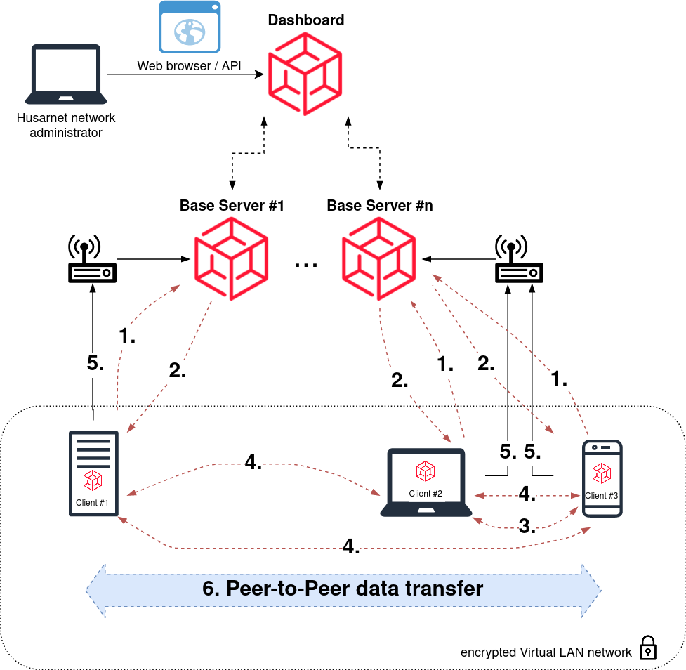

# **Husarnet**

## **Introduction**

Husarnet is a global P2P network layer dedicated especially for robotic and IoT use cases with first class ROS support. It can be however used in much more areas such as, for example, automotive industry (V2V/V2X) or connecting distributed, critical resources like Smart Grids. It can be used in typical use cases for VPN networks as well.

## **Solution Architecture**

Husarnet solves these problems by having a peer-to-peer architecture. Central server **(Husarnet Base)** only helps in establishing connections over the Internet. LAN connections may be established without any Internet access.

Husarnet, in it's core, is one big, automatically routed, IPv6 network. Running Husarnet daemon creates a virtual network interface (hnet0) with an unique Husarnet IPv6 address and associated fc94::/16 route. If the permission system is disabled, any node can reach any other on its IPv6 fc94:... address.

The nodes are identified by their 112-bit IPv6 addresses. The IPv6 address is based on hash of the node public key. All connections are also authenticated by the IPv6 address.

## **Whitelisting**

Husarnet, by default, accepts connections only to nodes that are on its whitelist. Whitelist is simply a list of IPv6 addresses that are allowed to connect to your node (remember that the addresses are also cryptographic identifiers).

The whitelist can be managed either manually or via Websetup protocol. The Websetup protocol is used by the Husarnet Dashboard, which is a hosted service for managing Husarnet networks. The Websetup protocol is very simple - the Dashboard sends an UDP message over Husarnet containg the requested changes (e.g. whitelist-add or whitelist-rm). The message is authenticated with a shared secret and a separate IPv6 whitelist.

## **How connections are established**

1. First, the Husarnet Client connects to the Husarnet Base Server (via TCP on port 443 and optionally UDP on port 5582) hosted by Husarnet company. Husarnet company runs multiple geographically distributed Husarnet Base Servers.  

2. Initially the encrypted data is tunnelled via the Husarnet Base Server.
3. The devices attempt to connect to local IP addresses (retrieved via the Base Server). This will succeed if they are in the same network or one of them has public IP address (and UDP is not blocked).
4. The devices attempt to perform NAT traversal assisted by the Base Server. This will succeed if NAT is not symmetric and UDP is not blocked on the firewall.
5. The devices send multicast discovery to the local network. This will succeed if the devices are on the same network (even if there is no internet connectivity or the Base Server can't be reached).
6. If peer-to-peer connection between devices is established, then user data goes directly between computers with Husarnet Client installed.

## **Role of a Husarnet Base Server**
 

- Storing all the connected clients' public IP addresses (and some other data)

- When establishing connection between two peers, exchanging their public IP addresses between them
- When P2P connection cannot be established between any pair of peers, transmitting all the data between them

## References

[Official Site](https://husarnet.com/)