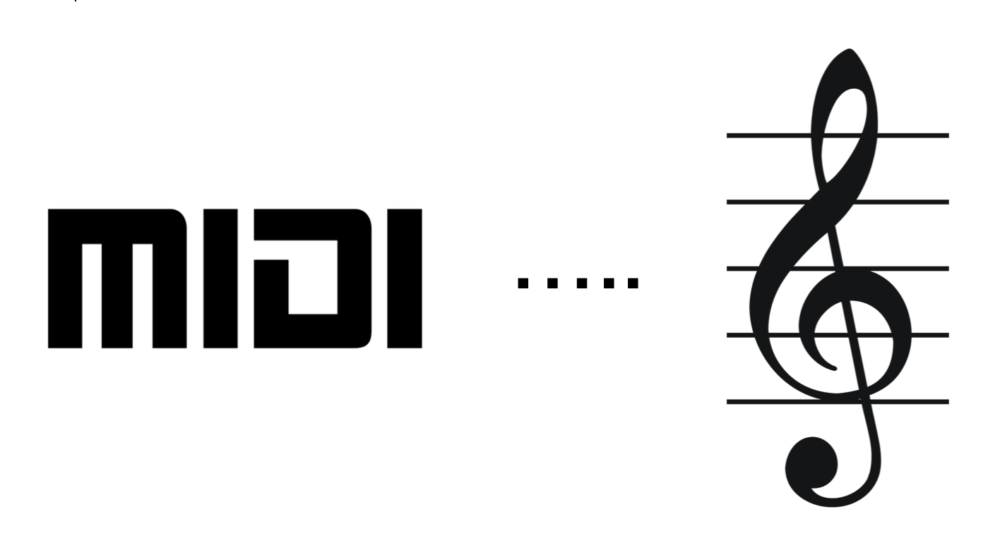

# MIDI to Sheet Music




Our product will often use MIDI messages to transmit data between the keyboard visualizer bar and the processing unit. But MIDI itself isn't interactive with most of the beginners. They'll be needing score sheets or sheet music to recognize what to play or, what is being played in his/her keyboard synthesizer. Therefor we'll be introducing a feature in a our web and mobile apps to convert these midi files to sheet music. We'll be using 
[BYVoid/MidiToSheetMusic](https://github.com/BYVoid/MidiToSheetMusic) opensource project to acheive this. </br></br>

[](https://padlet.com/sathiiii/RKT_Discussion) 

## Build

### Requirments :
* [Mono](https://www.mono-project.com/docs/getting-started/install/windows/)
* [Make](https://sourceforge.net/projects/mingw/files/Installer/mingw-get-setup.exe/download)

This is only deveoped for Windows

```bash
# Clone BYVoid/MidiToSheetMusic repository
C:\> git clone https://github.com/BYVoid/MidiToSheetMusic.git

# Go into the repository
C:\> cd MidiToSheetMusic

# Run makefile
C:\> make
```

This will create the executable file sheet.exe

Note : This project was done in 2013. Therefor the C# compiler in the makefile has to be changed from gmcs to mcs.

## Usage

### Windows :
```bash
C:\> sheet.exe <input>.mid <output>
```
### MacOS or Linux :
```bash
$ mono sheet <input>.mid <output>
```

Follow the given example,

## Download

[Source Code](https://github.com/BYVoid/MidiToSheetMusic/archive/master.zip)

[Executable File]()
