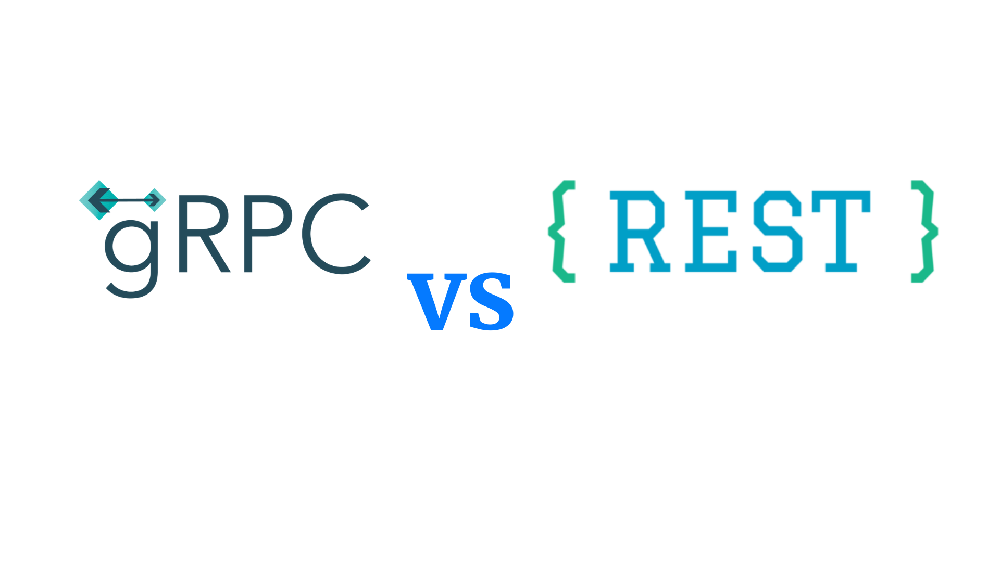
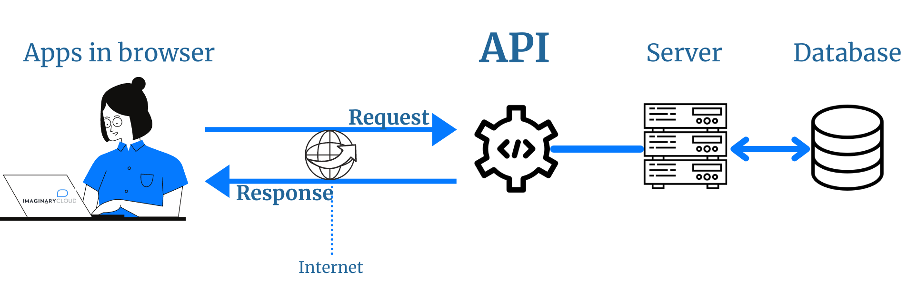
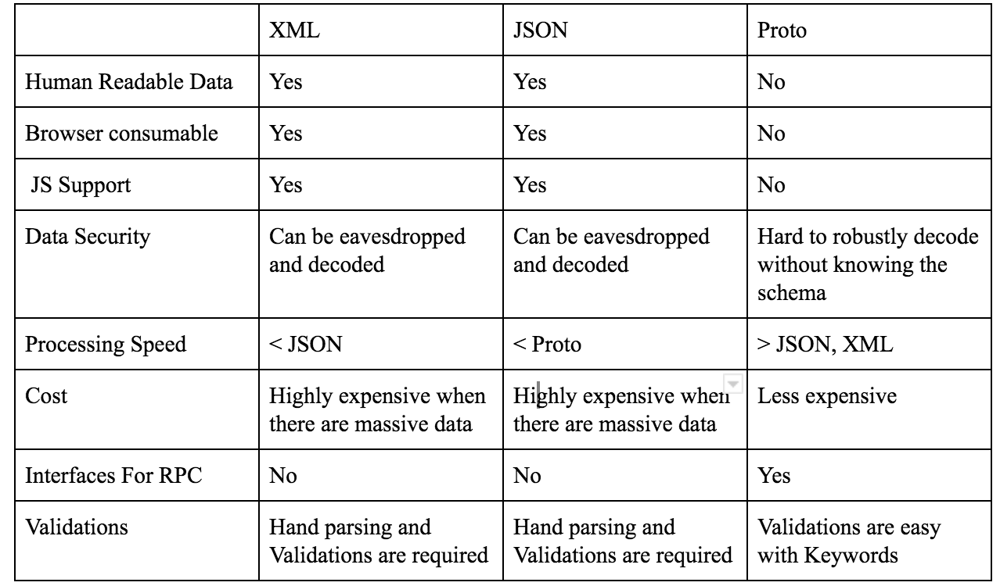
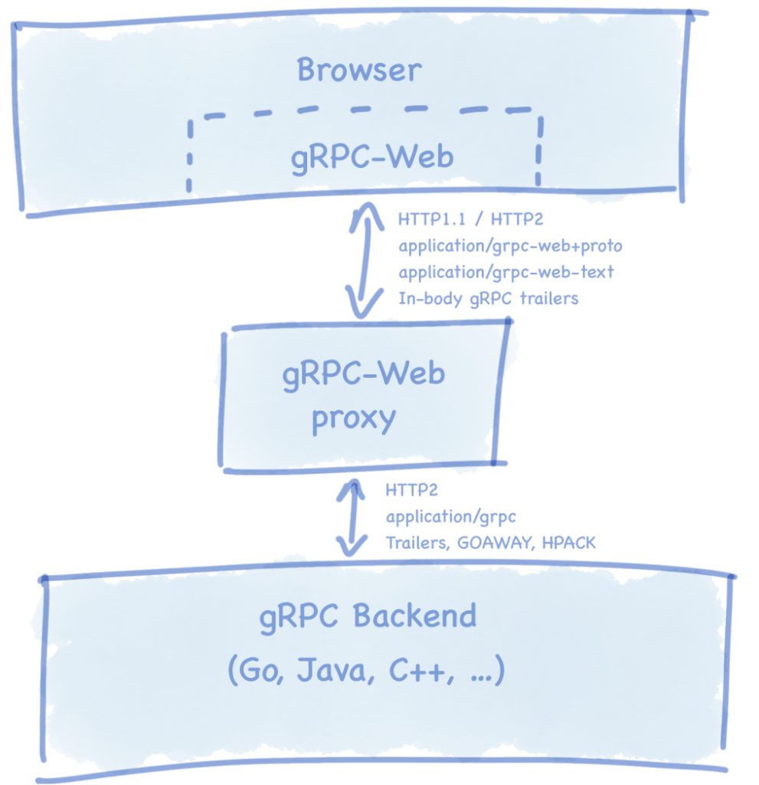

# REST vs gRPC

Oranges vs Apples? REST is an **architectural pattern**, but gRPC is a **framework** for implementing RPC APIs via HTTP/2.

Hmmmmmmmmmmmm?🤔

### _Our goal: Make the communication between ESP32s as fast as possible._

Two primary models for API design:
1. REST
2. RPC

Regardless of model, most modern APIs are implemented by mapping them in one way or another to the same HTTP protocol.

Most public APIs and many private distributed APIs **use HTTP as the transport**, at least in part because organizations are accustomed to dealing with the security issues of allowing HTTP traffic on ports 80 and 443.

## What is an API?

APIs stand for Application Programming Interfaces. These interfaces serve as a software intermediary that establishes **specific determinations and rules for applications to interact and talk to each other**.

An API is responsible for delivering a **response from a user to a system**, which in turn is sent back **from the system to the user**.

## APIs and Microservices

In a **monolithic application** (a platform consisting a database, server side and a client side), all the project's functionalities are included in a single codebase.

But a **microservice architecture** comprises several smaller services that communicate with each other using protocols like HTTP.

The component services that are part of the microservices architecture communicate and interact with each other through APIs. In other words, APIs allow all the services that are integrated into a microservice application **to connect and communicate**.

The most used architectural style is the REST API.

## REST: It's all about resources

REST by its very nature is **stateless**, and is built in such a way that any web service that is compliant with REST can interact in a stateless manner with textual **resource representations**.

This architectural model tends to follow the HTTP protocol. These operations are usually defined using GET, POST, PUT, and other HTTP methodologies as a matter of standardized interactions.

When using REST APIs, the response from the back-end data is passed to the clients through the JSON or XML messaging format.

### Advantages:

* Easy to understand.
* Web infrastructure is already built on top of HTTP.
* Tools for inspection, modification, testing are readily available.
* Loose coupling between client and server makes changes relatively easy.
* There are lot of frameworks in most of the widely used languages to create REST API’s.
* Http status codes are well defined and helps in identifying cause of problems.

### Disadvantages:

* While creating RESTful services, most of us follow a standard practice of writing client library and all we need to do is update client library whenever there is a change in api contracts.
* Streaming is difficult and its highly impossible in most of the languages.
* Duplex streaming is not possible.
* Hard to get multiple resources in single request.
* Need semantic versioning whenever the api contract needs to be changed.

Are these pain points are not there in gRPC? How does microservices talk to each other without a client library? The answer is google's **protobuf**.

## gRPC: It's all about APIs

gRPC owes its success to the employment of two techniques: using **HTTP/2** instead of HTTP/1.1 (but HTTP is not exposed to the API designer) and **protocol buffers** as an alternative to XML and JSON.

gRPC can use protocol buffers as both its **Interface Definition Language** (IDL) and as its underlying message interchange format.

RPC (Remote Procedure Call) is classic and the oldest API style currently in use. It uses **procedure calls** to request a service from a remote server **the same way you would request a local system** — via direct actions to the server (like SendUserMessages, LocateVehicle, addEntry). RPC is an efficient way to build APIs; RPC messages are lightweight and the interactions are straightforward.

gRPC is based around the idea of defining a service, specifying the methods that can be called remotely with their parameters and return types. On the server side, the server implements this interface and runs a gRPC server to handle client calls. On the client side, the client has a **stub** (referred to as just a client in some languages) that provides the same methods as the server.

gRPC clients and servers can run and talk to each other in a variety of environments - from servers inside Google to your own desktop - and can be written in any of gRPC’s supported languages.

### Protobuf / Proto

Google protobuf or proto is just a mechanism for serializing structured data. Proto is smaller, simpler, faster and language neutral.

1. In a .proto text file, a programmer defines a schema.
2. Using a protoc compiler, this file is then automatically compiled into any of the numerous supported languages like Java, C++, Python, Go, Dart, Objective-C, Ruby, and more.
3. At runtime, messages are compressed and serialized in binary format.

Protobufs offer great advantages over JSON and XML!

### gRPC benefits

* **Lightweight messages:** Depending on the type of call, gRPC-specific messages can be up to 30% smaller in size than JSON messages.

* **High performance:** By different evaluations, gRPC is 5, 7, and even 8 times faster than REST+JSON communication.

* **Built-in code generation:** gRPC has automated code generation in different programming languages including Java, C++, Python, Go, Dart, Objective-C, Ruby, and more.

* **More connection options:** While REST focuses on *request-response architecture*, gRPC provides support for *data streaming with event-driven architectures*: server-side streaming, client-side streaming, and bidirectional streaming.

* **Connection Pool:** We can create connection pool containing persistent connection to server through managed channels with states connected or idle.

### gRPC Weaknesses

* **Lack of maturity:** Compared to its peer GraphQL that has over 14k questions on StackOverflow, gRPC currently has a little under 4k. With minimal developer support outside of Google and not many tools created for HTTP/2 and protocol buffers, the community lacks information about best practices, workarounds.

* **Limited browser support:** Since gRPC heavily relies on HTTP/2, you can’t call a gRPC service from a web browser directly, because no modern browsers can access HTTP/2 frames. However, Google implemented [gRPC Web](https://github.com/grpc/grpc-web) client in JavaScript with an upcoming support for Python, Java, and more languages for browser support.

A web client sends a normal HTTP request to the proxy, which translates it and forwards it to the gRPC server.

Currently, not all gRPC features and advantages are available via web clients, although Google has a roadmap of upcoming features (like full streaming support and integration with Angular) that might ease the workload of using a proxy altogether.

* **Steeper learning curve:** Compared to REST and GraphQL, which primarily use JSON, it will take some time to get acquainted with protocol buffers and find tools for dealing with HTTP/2 friction.

* **No URL end points:** Can’t be tested with postman or curl to check the response.

* **No predefined status codes:** Creating custom status code may end up in conflicts.

## When to use gRPC vs REST?

* REST APIs may have their disadvantages, as we have discussed, but they remain the most known APIs for connecting microservices-based systems.
* gRPC may be used when operating an IoT system that requires light-weight message transmission such as the serialized Protobuf messages allow.
* gRPC should also be considered for mobile applications since they do not need a browser and can benefit from smaller messages, preserving mobiles' processors' speed.

## Conclusion

**Therefore, we have to options:**

1. Implement the backend using fully gRPC with the help of gRPC Web for the frontend support.
2. Use REST with protobuff instead of JSON/XML for the web clients and gRPC for communication between ESP32s.