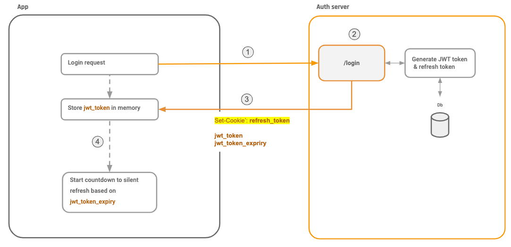
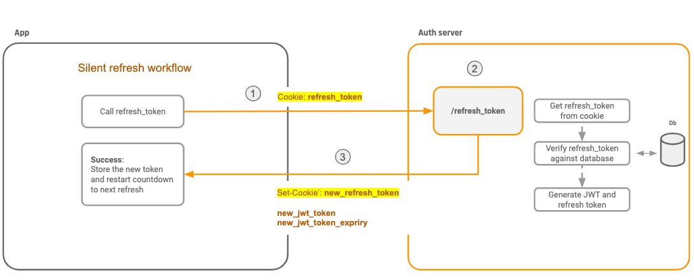

# Stateless Authentication: Persisting JWT Tokens

## Introduction

Authentication has been a stateful affair for a long time where all user details were stored server-side. This is known as **Stateful Authentication**. For complex architectures this can be limiting: getting data from the central store for every other operation can be troublesome.  Also, the server needs to keep the session’s state and data in its memory. 

If authentication and authorization were stateless each operation would carry all necessary data contained in them. This can be achieved using **tokens**.

**JSON Web Tokens (JWT)** are tokens generated by the server upon user authentication on a web application, and then sent to the client (usually a browser).


These tokens are then sent on every HTTP request, which allows the server to authenticate the user.

To ensure integrity, information contained in the token is signed by a **private key**, owned by the server. When the server gets the token back from the client, it just has to compare the signature sent by the client with the one it will generate with its private key. If the signatures are identical, the token is then valid.

## Anatomy of a JWT

According to RFC 7519, a JWT token is made of the following elements:

* A **Header** section, containing the algorithm used for the signature, as well as the type of token (**JWT** in our case). The whole thing is encoded in Base64.
* A **Payload** section, containing the token data, such as the user name, date of token generation or expiry date. All of that is written in JSON and also encoded in Base64.
* A **Signature** section, that is the result of Header and Payload, concatenated and then encrypted with the private key.

### Example of a JWT

**Header** section:
```
{
    “alg”: “HS256”,
    “typ”: “JWT”
}
```

**Payload** section:
```
{
    “iat”: 1480929282,
    “exp”: 1480932868,
    “name”: “Username”
}
```

A lot of information can be put into the second section (Payload), like the username, or the user’s rights on the application. The JWT specifications however clearly mention some keywords to be used, like “iat” (issued at = date and time of token generation, with a timestamp) or exp (expiry date).

## Refresh Tokens ✨

Refresh tokens server at least two purposes: first, the refresh token is a kind of 'proof' that an OAuth2 Client has already received permission from the user to access their data, and so can request a new access token again without requiring the user to go through the whole OAuth2 flow. Second, it helps increase the whole flow of security when compared with a long lived access token. Refresh tokens can be used to make the user experience more seamless, as the user doesn’t have to go through the whole OAuth2 flow again.

## Storing a JWT in the browser

Storing a token in client-side storage can be vulnerable to attacks. Therefore, if someone wants to completely prevent cross-site attacks, the best way is to store the tokens in memory (redux storage). But that'll reduce the quality of the user experience because the user will have to re-authenticate (login) every time the page is refreshed (redux storage is not persistent). In a web application like ours (an e-learning platform), this is bad.

Therefore, we have to somehow store the token in the browser such that the vulnerabilities that they can be exploited are quite unlikely. The following is an analysis and **our thinking process** of finding different ways to store a token in the client-side:

There are two ways to store data in a browser:

1. Local Storage (or Session Storage - which is the same as the local storage but is deleted when the session ends).
2. Cookies.

But they both have the following vulnerabilities:

* **Local storage** *is* vulnerable to **XSS** (Cross-Site-Scripting) attacks: If a malicious third party is able to inject JS into our web application, they can make requests to our API using the tokens and then collect the results on their servers and/or perform actions while acting as the user (deleting/updating data etc.) Basically, **if someone has JS in our app, they can do anything and everything the user is authorized to do**.

* **Local storage** *isn't* vulnerable to **CSRF** (Cross-Site-Request-Forgery) attacks: CSRF works by making a request to the API from another domain. But local storage is only accessible from the same domain (i.e. if our app forte.com has saved data in the local storage, then maliciousapp.com can't access them).

* **Cookies** *are* vulnerable to **XSS** attacks: Cookies can be made secure for XSS attacks with all the correct flags (httpOnly, secure, sameSite) so that injected JS can't access them. However, even with those flags, if a third party had successfylly inject JS into our app, they could still make requests to the API acting as they are the authenticated user. This is because even though they can't access the tokens - the cookie is still sent with every request. So the API will see that the token in the cookie is valid and respond to the request. At this point the attacker can perform as many data mutations as they want and they can make GET requests then send the responses to their own server using some basic javascript. It doesn't take a particulary smart hacker to cook up a basic JS script that does this - essentially turning users' browsers into proxies for malicious requests.

* **Cookies** *are* vulnerable to **CSRF** attacks: Cookies are intrinsically vulnerable to CSRF because they are automatically sent with each request. This allows attackers to easily craft malicious requests that lead to CSRF. Although the attacker cannot obtain the response body or the cookie itself, they can perform actions with the victim's elevated rights as mentioned above. It is important to note that HttpOnly and sensible CORS policies cannot prevent CSRF form-submit attacks and using cookies require a proper CSRF mitigation strategy.

Therefore, comparing the two vulnerabilities, we can see that **local storage is relatively more secure than cookies**.

However, before we proceed to finding a secure way for token storage, we have to keep in mind that just in case the option of using **redux states** is also there if we can somehow find a solution for making the tokens persistent.

### Strategy - 1: Trying to store the tokens in the browser using local storage and cookies with a secure strategy

We saw this strategy on [this](https://www.reddit.com/r/reactjs/comments/cubfsa/local_storage_vs_cookies_authentication_tokens/) subreddit. It's a simple solution that utilizes both local storage and cookies.

The idea is to store the refresh token and access token in httpOnly Secure cookies.

Then use another token in the authentication called the **CSRF Token**. The API should require this token to be in every request. Then, even if the request had a valid access token, the API wouldn't respond unless it was accompanied by a valid CSRF token.

The CSRF token has to be stateless. We can make the CSRF token a hash of the refresh token and then include in the JWT payload.

This way, on routes that require the refresh token (/auth/refreshToken), the API can verify that the CSRF token is valid by just hashing the refresh token and comparing it to the CSRF token in the cookie sent with the request.

On all the other routes that require just the access token, the API can compare the CSRF token in the JWT payload with the CSRF token in the cookie passed in the request.

**Can't an attacker hash the refreshToken themselves to generate a valid CSRF?** -> No, because the refreshToken will be stored in a Secure HttpOnly cookie - JS can't see it.

**Can't an attacker just look at the JWT claims to get the valid CSRF** -> The Access Token is also stored as a Secure HttpOnly Cookie, JS can't see it.

This CSRF token will be stored in LocalStorage (rendering CSRF attacks ineffective since they rely solely on cookies).

However, the above strategy doesn't totally prevent third parties from making requests to the API and performing actions as the user because an attacker doesn't need to have access to the tokens in order to make requests to the API. An attacker can exploit the fact that the Refresh and Access tokens are stored in cookies (so they are automatically sent in every request) and they can get the CSRF token by querying LocalStorage.

Note that the new **SameSite cookie** spec which is getting increased support in most browsers will make Cookie based approaches safe from CSRF attacks.

### Strategy - 2: Proceeding with redux states

As discussed earlier, the access token stored in redux storage will be nullified when the user switches between tabs or refreshes the page. Therefore, we have to find a way to make the tokens persistent.

The idea is to use refresh tokens!



1. The user logs in with a login API call.
2. Server generates JWT Token and refresh_token.
3. Server sets a **HttpOnly cookie with refresh_token**. jwt_token and jwt_token_expiry are returned back to the client as a JSON payload.
4. The jwt_token is stored in memory.
5. A countdown to a future **silent refresh** is started based on jwt_token_expiry.

**Silent refresh** is the way to refresh the access token before the short lived access token expires without the user having to log in again.

Because client side Javascript can't read or steal an HttpOnly cookie, this is a little better at mitigating XSS than persisting it as a normal cookie or in localstorage.

This is safe from CSRF attacks, because even though a form submit attack can make a /refresh_token API call, the attacker cannot get the new JWT token value that is returned.



1. Call /refresh_token endpoint
2. Server will read httpOnly cookie and if it finds a valid refresh_token, then...
3. ...the server returns a new jwt_token and jwt_token_expiry to the client and also sets *a new refresh token* cookie via  Set-Cookie header.

Refresh tokens have a long lifetime. If they are valid and not expired, clients can obtain new access tokens. This long lifetime may lead to vulnerability for protected resources. That's why when a new access token is requested by calling the /refresh_token endpoint, the old refresh token is invalidated and a new one is sent. This is known as **refresh token rotation**. The purpose of **refresh token rotation** is to eliminate the vulnerability risk posed by long-lasting refresh tokens.

Note that **using refresh tokens make the authentication process stateful** since they have to be stored in the server database. But we might have to compromise that in order to make the user experience better and to make authentication secure.

However with the above strategy, the session will still be lost if the user closes the tab or refreshes the page.

**Refresh tokens to the saving! ✨**

Since refresh tokens are persisted as an httpOnly cookie, we can use them to fetch a new JWT token for a new session when the user logged out of their current session by closing the tab or refreshing the page. Now that the user visits the app again, let's see what the flow looks like:


1. If we see that we don't have a JWT in redux memory, then we trigger the silent refresh workflow.
2. If the refresh token is still valid (or hasn't been revoked), then we get a new JWT and we're good to go!

In case our refresh token expires (say the user comes back to the app after a really long time), or gets revoked (because of a "force logout", say) the client will get 401 error for an unauthorized refresh_token. Another case might just be that we don’t have any refresh_token in the first place, in which case we'll also get an error from our /refresh_token endpoint and we will redirect the user to the login screen.

## Refresh Token Reuse Detection

Refresh token reuse detection is a mechanism that supports refresh token rotation. When an access token expires, the client gets a new set of tokens (access and refresh token) using a refresh token. Then, the identity provider immediately invalidates the previous refresh token.

If the identity provider detects the use of that invalidated refresh token, it immediately invalidates all the refresh and access tokens making the client authenticate using login credentials again. This mechanism prevents our app from malicious attacks when there is a leakage of tokens.

## Force Logout

Now that are users are logged in forever and stay logged in across sessions, there's a new problem that we need to worry about: Force logout or, logging out of all sessions and devices.

The refresh token implementations from the sections above, show us that we can persist sessions and stay logged in.

In this case, a simple implementation of "force logout" is asking the auth server to invalidate all refresh tokens associated for a particular user.

This is primarily an implementation on the auth server backend, and doesn't need any special handling on the client.